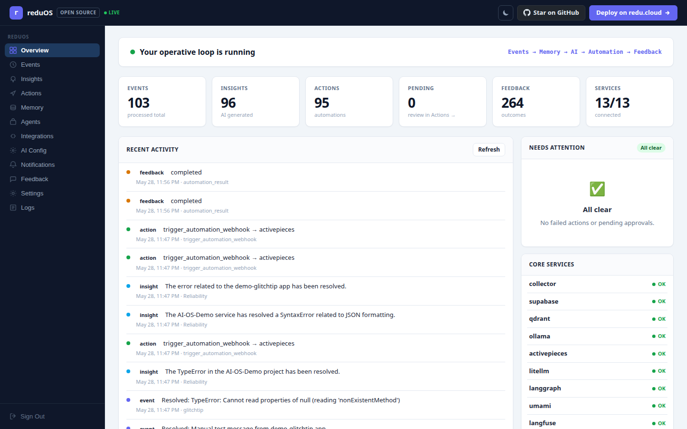
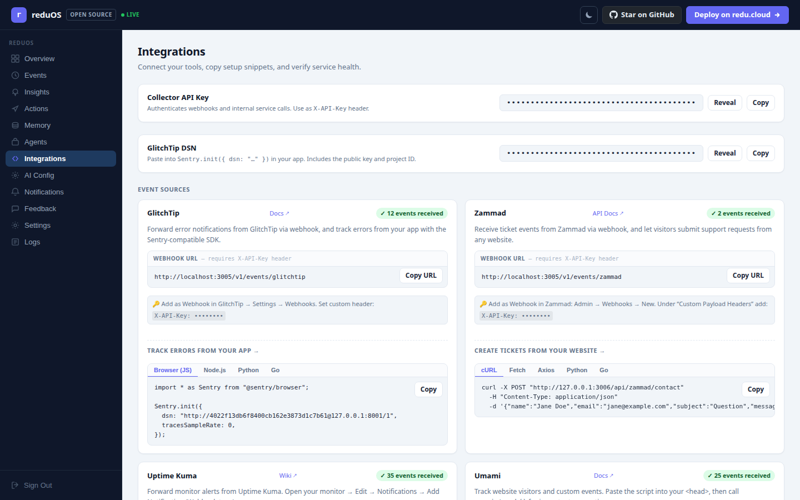

<div align="center">

# reduOS

**The self-hosted AI operative system for startups**

Connect your tools. Watch events. Get AI insights. Automate. Remember what worked.

[](LICENSE)
[](https://www.typescriptlang.org/)
[](https://podman.io/)
[](#testing)

[Quick Start](#quick-start) · [Integrations](#integrations) · [How it learns](#how-it-learns) · [Contributing](#contributing) · [Docs](docs/)

</div>

---



---

## What is reduOS?

reduOS is a self-hosted operations layer that sits between your tools and your team. It collects events from error trackers, support desks, uptime monitors, analytics, and email tools — normalises them into one schema, runs AI analysis, triggers automation, and stores every outcome as memory for future decisions.

The core loop:

```
Event → Collector → Supabase → Qdrant memory → AI analysis → Activepieces → Notifications → Feedback → Future context
```

Every time something is resolved — a ticket closed, downtime recovered, an error fixed — reduOS links the outcome back to the original event. The next time something similar happens, the AI sees what happened last time.

A second loop runs automatically every 5 minutes: the **cross-source correlator** scans recent events from all connected tools, asks LangGraph whether events across different sources are causally related, and fires an in-dashboard alert when a correlated incident is detected. Approving or rejecting the correlation writes back to Qdrant so future correlation runs remember what was a real incident and what was noise.

---

## Quick Start

> Requires [Podman](https://podman.io/) and [podman-compose](https://github.com/containers/podman-compose).

```bash
git clone https://github.com/redu-cloud/redu-os
cd redu-os
cp .env.example .env
npm install
npm run full
```

`npm run full` starts all services. The first run pulls `deepseek-r1:1.5b` and `nomic-embed-text` — allow a few minutes.

Open **http://127.0.0.1:3006** and sign in:

```
Email:    admin@example.com
Password: ChangeMeStrong123!
```

**Useful commands:**

```bash
npm run status        # Check what's running
npm run doctor        # Health check all services and models
npm run demo:full     # End-to-end demo: event → AI → automation → notification
npm run logs          # Tail all logs
npm run stack:down    # Stop everything
```

---

## Integrations

reduOS connects to the tools startups already use:

| Tool | Events captured | Full AI loop |
|---|---|---|
| **GlitchTip** | Error created, error resolved | ✅ |
| **Zammad** | Ticket created, ticket resolved | ✅ |
| **Uptime Kuma** | Monitor down, monitor recovered | ✅ |
| **Listmonk** | Subscriber joined, subscriber churned | ✅ |
| **Umami** | Page views, custom events | ✅ |
| **Custom apps** | Any event via `/v1/events` | ✅ |

**Full AI loop** means: event received → stored in Supabase → embedded in Qdrant → AI generates insight → Activepieces triggers automation → Discord/Slack/Telegram notification fires → outcome linked back as feedback.

Each service can also be started individually with `npm run modular:<service>:up`.



---

## How it learns

Most ops tools fire alerts and forget. reduOS records outcomes.

When a ticket is resolved, reduOS automatically finds the original `ticket.created` event, calculates how long it took, and writes a scored feedback record linked to the AI insight and action that fired. When a monitor recovers, the same happens for the downtime event.

```
support ticket created (ticket_id: 42)
  → AI insight: "auth service issue, check JWT config"
  → Activepieces: creates Notion task
  → [3 hours later] ticket closed
  → auto-feedback: score +1, delta 3h, linked to original event
```

Next time a similar ticket arrives, the AI receives: *"last time this happened, it took 3 hours to resolve via JWT config fix."*

This context lives in Qdrant vector memory and is retrieved by semantic similarity — no manual tagging required.

---

## AI Configuration

AI provider is set in `.env` and switchable at runtime from the dashboard (`/#ai-config`):

| Provider | Config |
|---|---|
| **Ollama** (default) | `AI_PROVIDER=ollama`, `OLLAMA_MODEL=deepseek-r1:1.5b` |
| **LiteLLM gateway** | `AI_PROVIDER=litellm` — routes to OpenAI, Anthropic, Gemini, Groq, OpenRouter |
| **OpenAI-compatible** | `AI_PROVIDER=openai-compatible` + `AI_CHAT_BASE_URL` |
| **Fallback** | `AI_PROVIDER=fallback` — stores events, skips model calls |

Switch provider or model without restarting from `/#ai-config` in the dashboard.

---

## Stack

`npm run full` starts all 15 services:

| Service | Port | Purpose |
|---|---|---|
| Collector (Fastify/TypeScript) | 3005 | Event ingestion, AI loop, webhook endpoints |
| Dashboard (Fastify/TypeScript) | 3006 | 12-page SPA — events, insights, actions, memory, agents, logs |
| Supabase API | 8000 | Structured storage (events, insights, actions, feedback) |
| Supabase Studio | 3000 | Database browser |
| Qdrant | 6333 | Vector memory for semantic retrieval |
| Ollama | 11435 | Local AI models (deepseek-r1, nomic-embed-text) |
| LiteLLM | 4000 | AI gateway — routes to OpenAI, Anthropic, Gemini, Groq, OpenRouter |
| LangGraph | 3010 | Multi-step agent workflows + cross-source correlator (Python/FastAPI) |
| Activepieces | 8080 | Automation flows triggered by AI insights |
| Uptime Kuma | 3001 | Uptime monitoring with alerting |
| Umami | 3002 | Privacy-friendly analytics |
| GlitchTip | 8001 | Error tracking (Sentry-compatible) |
| Listmonk | 9000 | Email lists and campaigns |
| Zammad | 8081 | Support desk / helpdesk |
| Langfuse | 3007 | LLM tracing and observability |

---

## Testing

```bash
npm test          # 65 normalizer unit tests
npm run check     # TypeScript type check
npm run doctor    # Full service health check
```

---

## Contributing

Contributions are welcome — integrations, tests, dashboard improvements, AI prompt tuning, docs.

See [CONTRIBUTING.md](CONTRIBUTING.md) for dev setup, how to add a new integration, and the review process.

---

## Documentation

| Doc | Contents |
|---|---|
| [AI Loop](docs/ai-loop.md) | How events become insights and how feedback closes the loop |
| [Local Stack and Use Cases](docs/local-stack-and-use-cases.md) | One-command stack, curl examples, service-by-service walkthroughs |
| [Deployment Modes](docs/deployment-modes.md) | Single machine vs modular split-VM layout |
| [Production Deployment](docs/production-deployment.md) | HTTPS, secrets, backups, upgrades |
| [Integration Webhooks](docs/integration-webhooks.md) | Webhook setup for every supported tool |
| [AI Provider Modes](docs/ai-provider-modes.md) | Ollama, LiteLLM, OpenAI-compatible, fallback |
| [LangGraph Agents](docs/langgraph.md) | Multi-step agent workflows and cross-source correlator |
| [Cross-Source Correlator](docs/correlator.md) | Automatic incident correlation across all connected tools |
| [Activepieces Automation](docs/activepieces.md) | Automation flow setup and templates |

---

## License

Apache 2.0 — see [LICENSE](LICENSE).
